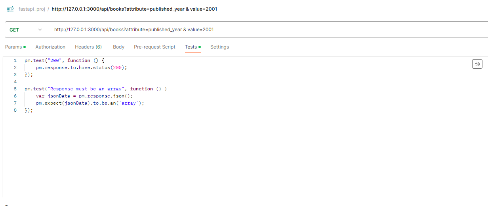

# Postman Installation and User Guide

## Introduction

Postman is a popular tool for API development and testing. It allows developers to build, test, and document APIs easily. This guide will help you with the installation process and provide a basic overview of how to use Postman.

## Installation

### Step 1: Downloading Postman

1. Visit the Postman website to download the application. [Postman Downloads](https://www.postman.com/downloads/).
2. Choose the version suitable for your operating system (Windows, MacOS, Linux).
3. Click on the download link to start the process.

### Step 2: Installing Postman

- After downloading, open the installer file.
- Follow the on-screen instructions to complete the installation.

## Getting Started with Postman

### Creating an Account

- Upon opening Postman for the first time, you will be prompted to create an account. This can be done using an email address, Google account, or other sign-in methods.
- Creating an account allows you to sync your collections across devices and access more features.

### Postman Interface

- Familiarize yourself with the Postman interface. Key areas include:
  - **Request Tab**: Where you create new requests.
  - **Response Section**: View responses to your requests.
  - **Collections**: Organize your requests and tests.

### Making Your First API Request

1. Click on the `New` button and select `Request`.
2. Enter the details for your request:
   - **URL**: Enter the API endpoint you wish to test.
   - **Method**: Select the HTTP method (GET, POST, PUT, DELETE, etc.).
   - **Headers/Body**: Add as needed depending on your API requirements.
3. Click `Send` to execute the request.
4. The response will appear in the section below.
5. 
   

### Saving Requests

- Save your requests in collections for easy access and organization.
- Click on the `Save` button after setting up your request and specify the collection to save it in.

### Using Collections and Environments

- **Collections**: Group related requests for easier management and execution.
- **Environments**: Use environments to manage sets of variables for different setups (like development, testing, production).
- 
- 

### Writing Basic Tests

- Postman allows you to write tests in JavaScript in the `Tests` tab.
- These tests can validate various aspects of the response, such as status codes and response bodies.

### Running Collections

- Use the Collection Runner to run a series of requests in a collection, which is useful for automated testing.

## Conclusion

This guide provides basic steps to get started with Postman. For more advanced features and detailed documentation, visit the [Postman Learning Center](https://learning.postman.com/).
